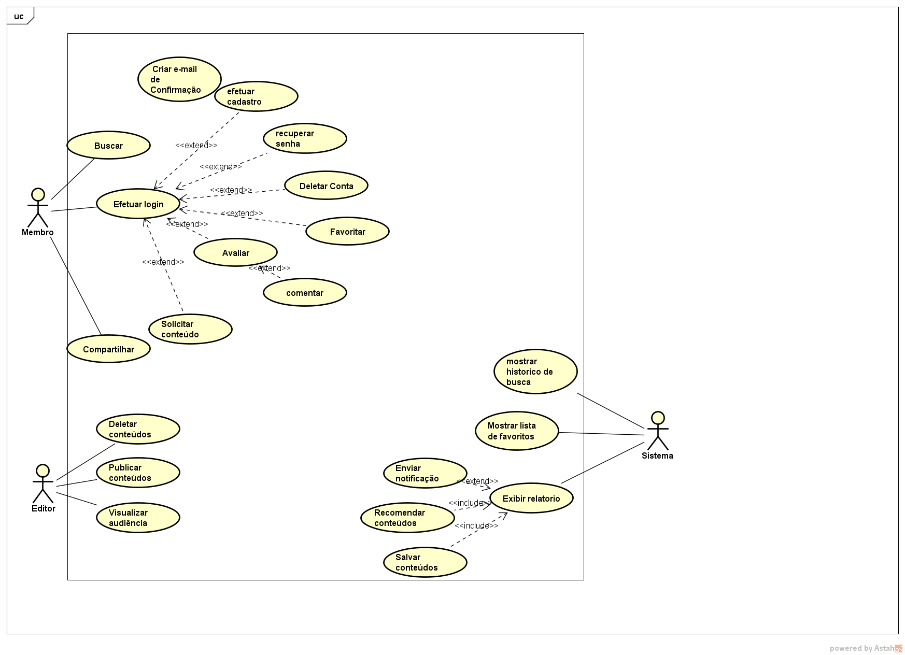
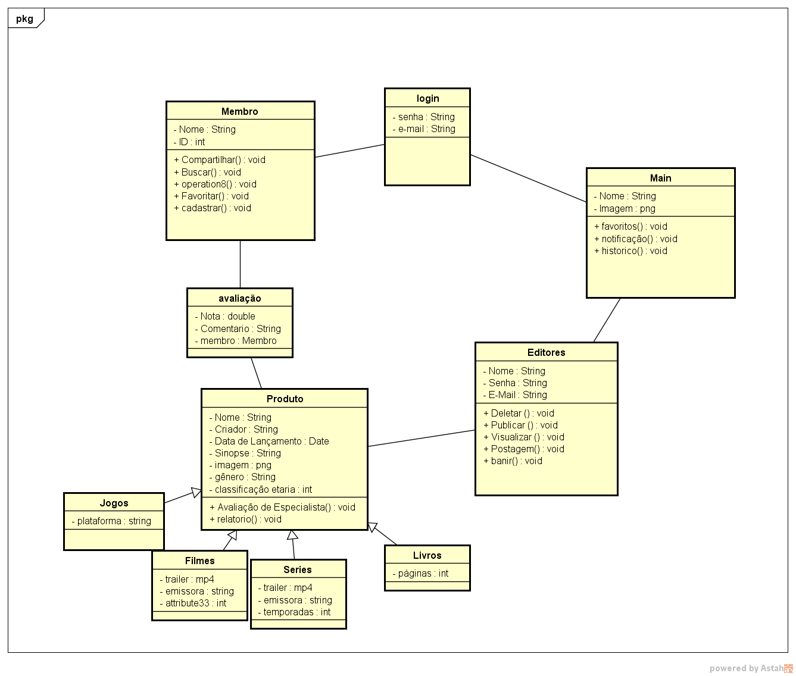

# *CanalBis*

# PROJETO DE SOFTWARE

## *Stakeholders*
|NOME|CARGO|E-MAIL|
|:---|:---|:---|
|Alana Tarcila Martins Alves|Gerente de Projeto|alanaimportant@gmail.com|
|Daiany Kelly Campos Silva|Designer de Inteface com o Usuário|daiihkel@gmail.com|
|Diego Vinicius Daniel da Silva|Analista de Teste|diegoviny000@gmail.com|
|João Pedro Pires e Macedo|Testador de Software|joaopedropiresemacedo2006@gmail.com|
|Uéliton Pereira Novais|Programador|elrockimportant@gmail.com|

# Sumário

* [RESUMO DO PROJETO](#resumo-do-projeto)
* [INTRODUÇÃO](#introdução)
  * [PROPÓSITO DESTE DOCUMENTO](#propósito-deste-documento)
  * [ESCOPO DO PROJETO](#escopo-do-projeto)
  * [CONCEPÇÃO DO SISTEMA](#concepção-do-sistema)
  * [CONVENÇÕES, TERMOS E ABRIVEAÇÕES][def]
* [DESCRIÇÃO GERAL](#descrição-geral)
  * [USUÁRIOS DO SISTEMA](#usuários-do-sistema)
  * [ABRANGÊNCIA E SISTEMAS SIMILARES](#abrangência-e-sistemas-similares)
  * [SUPOSIÇÕES E DEPENDÊNCIAS](#suposições-e-dependências)
* [ESTUDO DE VIABILIDADE](#estudo-de-viabilidade)
  * [VIABILIDADE TÉCNICA](#viabilidade-técnica)
  * [VIABILIDADE ECONÔMICA](#viabilidade-econômica)
  * [VIABILIDADE ORGANIZACIONAL](#viabilidade-organizacional)
* [METODOLOGIA ADOTADA NO DESENVOLVIMENTO](#metodologia-adotada-no-desenvolvimento)
* [REQUISITOS DO SOFTWARE](#requisitos-do-software)
  * [REQUISITOS FUNCIONAIS](#requisitos-funcionais)
  * [REQUISITOS NÃO FUNCIONAIS](#requisitos-não-funcionais)
* [PROTOTIPAGEM](#prototipagem)
* [DIAGRAMA DE CASOS DE USO](#diagrama-de-casos-de-uso)
  * [ESPECIFICAÇÃO DOS CASOS DE USO](#descrição--especificação-dos-casos-de-uso)
* [DIAGRAMA DE CLASSES](#diagrama-de-classes)
* [DIAGRAMA DE SEQUÊNCIAS](#diagrama-de-sequências)
* [ DIAGRAMA DE ATIVIDADES](#diagrama-de-atividades)
* [REFERÊNCIAS](#referências)

# RESUMO DO PROJETO
| ITEM | DESCRIÇÃO|
|:---|:---|
| NOME DO PROJETO | CanalBis |
| GERENTE DO PROJETO | Alana Tarcila Martins Alves |
| PRINCIPAL OBJETIVO | Oferecer uma forma de entreternimento através de diferentes midias que poderão ser abertas e utilizadas por qualquer tipo de público. |
| BENEFÍCIOS ESPERADOS |* Promover o entreternimento para diversas idades; * Otimizar o tempo de busca do usuário dentro da web; * Melhorar o intelectual com filmes, series e livros com indicações apropriadas; * Reduzir o numero de acessos indevidos em sites improprios para isso; * Deixar os usuarios constantemente atualizados das novidades. |
| INÍCIO E TÉRMINO PREVISTOS | 14/03/2023 - 07/12/2023 |

[ [INÍCIO](#CanalBis) ]

# INTRODUÇÃO

## PROPÓSITO DESTE DOCUMENTO

Este documento destina-se aos stakeholders e à todos envolvidos nesse projeto. O objetivo do projeto **CanalBis** é ser um banco de informações sobre diversos tipos de entretenimentos como filmes e livros, contendo seus autores, nacionalidade, data de criação, locais onde podem ser acessados, entre outras informações.

## CONCEPÇÃO DO SISTEMA

Foram usados métodos para que pudessem ser obtidos os requisitos do sistema: 
* Reunião: 
  * Os envolvidos no projeto debateram para decidir qual tipo de projeto era mais agradável a todos;
* Consulta com especialista: 
  * Wagner, docente do curso técnico em informática na disciplina de Fundamentos e Analise de Sistemas que orientou na concepção do projeto inicial devido sua experiência em trabalhar na área; 
* Pesquisa: 
  * Afim de entender melhor sobre o projeto e sua acessibilidade, os envolvidos fizeram pesquisas sobre o assunto.

## CONVENÇÕES, TERMOS E ABREVIAÇÕES

Para evitar interpretações incorretas deste documento, algumas convenções e termos específicos são aceitos a seguir:

* Conteúdo: Quando citado no conteúdo do projeto, diz respeito a filmes, séries, livros, jogos.
* Cultura pop: Conteúdo principalmente de entretenimento que ficou popular ou ganhou espaço no seu meio.
* Login: Crie ou inicie uma sessão em sites ou aplicativos.
* Logout: encerrar uma sessão.
* Streaming: Tecnologia que permite consumir vídeos e áudios pela internet sem a necessidade de baixar os mesmos.

[ [INÍCIO](#CanalBis) ]

# DESCRIÇÃO GERAL

## ESCOPO DO PROJETO

### NO ESCOPO

O projeto consiste na construção de um site interativo *(CanalBis)*, que possibilite o entretenimento de forma simples e prática. O projeto visa promover ao usuário as melhores indicações conforme o gosto de cada um, a fim de cessar a indecisão na hora de escolher algo para ler, jogar ou assistir. 

Indicações como:
* Filmes indicados ao oscar;
* Séries com os melhores diretores;
* Livros mais bem avaliados pelo público;
* Jogos mais acessados recentemente.
E muito mais..

É um projeto que promete facilidade ao usuário e que possa ser utilizado por todos conforme sua faixa etaria.

O escopo do site pode ser consultado nos [requisitos do software](#requisitos-do-software)

### FORA DO ESCOPO

Não fazem parte do escopo do projeto:
* Treinamento de instalação, configuração, administração e  utilização do sistema;
* Personalização do site, como tema, cores ou posições;   
* O projeto CanalBis não hospeda os conteúdos apresentados, apenas as informações sobre eles.
* Apesar do nome, o projeto não está relacionado com canais de televisão.

## Usuários do sistema
|USUÁRIO|DESCRIÇÃO|
|:---|:---|
|**Usuário Padrão:**|Realizam as tarefas comuns a todos os usuários, como: logar. Todos demais usuários estendem as funcionalidades do UsuárioPadrão.|
|**Administrador:**|Responsáveis pelo gerenciamento das entidades pertinentes ao site e pela alocação de outros administradores.|
|**Membro:**|Podem fazer ações ligadas a sua conta, por exemplo: gerenciar sua lista de desejos, mandar mensagens, fazer comentários e editar seu perfil.|
|**Editores:**|Adicionam, editam e removem conteúdos do site.|

## Abrangência e sistemas similares

### Abrangência:

O sistema irá conter dados para facilitar o tempo de lazer do usuário. O editor ira editar os conteúdos que estaram disponíveis a todos os usuários. Os editores receberam feedbacks dos membros e sobre suas edições. Os administradores poderam editar os outros usuários e seus dados. 

Das ferramentas de planejamento podemos citar:

* **Ferramenta de edição:** Opção usada para configurar os conteúdos presentes no site;

### Sistemas similares:

Alguns sites que possuem a mesma ideia:

**IMDb ( www.imdb.com ):** Um dos maiores bancos de dados de filmes, programas de TV, atores e equipes de produção. Oferece informações subordinadas sobre filmes, séries de TV, elenco, equipe de produção, classificações, críticas, trailers e muito mais.

**IGN ( www.ign.com ):** Um dos maiores sites de entretenimento digital, oferece notícias, análises, prévias, vídeos e cobertura de diversos jogos para várias plataformas.

**GameSpot ( www.gamespot.com ):** O GameSpot é um site que se dedica à cobertura de jogos eletrônicos, fornecendo notícias, análises e vídeos sobre diferentes títulos e plataforma.

**Goodreads ( www.goodreads.com ):** Uma comunidade online de leitores que oferece recomendações, resenhas, listas de livros, grupos de discussão e a possibilidade de acompanhar sua própria biblioteca virtual.
## Suposições e dependências
O sistema necessita de um servidor web para sua hospedagem.

Os usuários devem utilizar um computador com a seguinte configuração mínima:

* Processador Dual Core 2GHz ou superior
* 1Gb de memória RAM
* 3Gb de armazenamento em disco

# ESTUDO DE VIABILIDADE

Uma vez definidos a necessidade para o sistema e seus requisitos de negócio, é possível compreender melhor o projeto do sistema proposto para elaborar o estudo de viabilidade com os seguintes destaques:

## Viabilidade Técnica
Os programadores do projeto possuem competência para criar o projeto necessário, em relação à tecnologia. O projeto não requer softwares complexos e possui porte. Portanto, podemos concluir que o projeto possui viabilidade técnica.

## Viabilidade Econômica

Com base em análises, chegamos à conclusão de que o projeto possui viabilidade econômica, uma vez que não requer custos elevados e gerará retornos à medida que for acessado por usuários.

## Viabilidade Organizacional

Do ponto de vista organizacional, este projeto apresenta baixo risco. Os diretores e coordenadores da instituição demonstram forte interesse no projeto. Espera-se que os professores e alunos aprovem a implantação do sistema, visto que atualmente a escola não possui uma ferramenta específica para o controle das informações, o que está provocando enormes transtornos para a instituição.

[ [INÍCIO](#CanalBis) ]

# Metodologia Adotada no Desenvolvimento

SCRUM

O projeto ira nescessitar de uma métodologia ágil, e com sua grande quantidade de conteudo ele deve ter uma metodologia boa para um progeto complexo, e precisara ser editado frequentemente e com uma boa velocidade para respeitar o seus prazos de entrega. nesse site produzido sempre será deixado claro o objetivo do projeto e assim focando nas atividades consideradas com maior prioridade, para que possa ser dividida de forma justa entre os editores. E dessa maneira iremos concluir  as demandas em menor tempo e com maior qualidade.

[ [INÍCIO](#CanalBis) ]

# Requisitos do Software

A especificação dos requisitos deste documento deve seguir as recomendações da norma IEEE Std-830-1998, levando em conta as recomentações do documento de [características dos requisitos](caracteristicas_requisitos.md).

## Requisitos Funcionais

A tabela a seguir contém a relação dos Requisitos Funcionais elicitados, com as colunas: identificador, nome, descrição e prioridade:

| IDENTIFICADOR | NOME | DESCRIÇÃO |
:---|:---|:---|
|RF-001 |Cadastro de usuário |Este caso de uso serve para que o usuário possa cadastrar-se ao sistema. |
|RF-002 |E-mail de confirmação |Este caso de uso serve para que o sistema envie um e-mail de confirmação de cadastro ao usuário. |
|RF-003 |Efetuar login |Este caso de uso serve para que o usuário possa conectar-se ao sistema. |
|RF-004 |Recuperar senha |Este caso de uso serve para que o usuário possa recuperar sua senha ao esquecê-la. |
|RF-005 |Buscas |Este caso de uso serve para que o usuário possa buscar fazer a busca do que deseja dentro do site. |
|RF-006 |Histórico de buscas |Este caso de uso serve para que o usuário tenha acesso ao seu histórico de pesquisas. |
|RF-007 |Controle de idade |Este caso de uso serve para que o usuário receba indicações conforme sua idade. |
|RF-008 |Solicitação de conteúdo |Este caso de uso serve para que o usuário possa solicitar o conteúdo que ele deseja ver no site, que não está disponível. |
|RF-009 |Lista de favoritos |Este caso de uso serve para que o usuário consiga criar uma lista de favoritos. |
|RF-010 |Relatório |Este caso de uso serve para que o sistema exiba um relatório dos conteudos mais acessados pelos usuários. |
|RF-011 |Confiabilidade |Este caso de uso serve para que o sistema seja confiavel e seguro para o usuário. |
|RF-012 |Conteúdo |Este caso de uso serve para que o sistema seja capaz de identificar e salvar conteúdos mais vistos pelo usuário. |
|RF-013 |Recomendação |Este caso de uso serve para que o sistema use os conteúdos salvos anteriormente para fazer recomendações precisas ao usuário. |
|RF-014 |Notificação |Este caso de uso serve para que o sistema envie notificações de atualização de conteúdo ao usuário. |
|RF-015 |Deletar conta |Este caso permite o usuário deletar sua própria conta com uma confirmação de senha.  |
|RF-016 |Publicação |Este caso de uso serve para que os desenvolvedores sejam capazes de publicar novos conteudos. |
|RF-017 |Avaliar |Este caso de uso serve para que o usuário seja capaz de avaliar o conteudo visto por ele. |
|RF-018 |Compartilhar |Este caso de uso serve para que o usuário consiga compartilhar qualquer publicação do site. |
|RF-019 |Visualização |Este caso de uso serve para que o usuário consiga vizualizar a quantidade de pessoas que acessou o conteudo. |
|RF-020 |Comentário |Este caso de uso serve para que o usuário tenha a opção de interagir dentro do site. |

## Requisitos Não Funcionais
A tabela a seguir contém a relação com os Requisitos Não Funcionais identificados, contendo identificador, nome, descrição e prioridade:

| IDENTIFICADOR | NOME | DESCRIÇÃO |
|:---|:---|:---|
|RNF-001 |Atuação |O sistema deve ser capaz de lidar com o número necessário de usuários sem qualquer degradação no desempenho. |
|RNF-002 |Disponibilidade |O sistema deve estar disponível quando necessário. |
|RNF-003 |Manutenção |O sistema deve ser fácil de manter e atualizar. |
|RNF-004 |Portabilidade |O sistema deve ser capaz de rodar em diferentes plataformas com alterações mínimas. |
|RNF-005 |Usabilidade |O sistema deve ser fácil de usar e entender. |
|RNF-006 |Publicidade |O sistema deve ter configuração possivel a integração de anúncios futuros. |
|RNF-007 |Deletar dados de contas |O sistema deve ser capaz de remover dados de uma conta deletada. |
|RNF-008 |Interoperabilidade |O sistema deverá se comunicar com o SQL Server. |
|RNF-009 |Integração |O sistema integra com outra aplicação. |
|RNF-010 |Dados |Este caso de uso serve para que o sistema não disponibilize dados pessoais do usuário para todos. |

[ [INÍCIO](#CanalBis) ]

# Prototipagem

[Protótipo criado no FIGMA em 2023 por estudantes](https://www.figma.com/file/fXI9jY72LIRrYv1v59EKhB/canalbis?type=design&node-id=0%3A1&t=mGrAoarZLzbgxZA1-1)

[ [INÍCIO](#CanalBis) ]

# Diagrama de Casos de Uso

## Descrição / Especificação dos Casos de Uso

### UC-01 - Cadastrar Professor

|UC-01 - Cadastrar Professor|           
|:---|
|**Descrição/Objetivo:** Permite a inclusão de novos professores no Sistema|
|**Atores: Administrador**|
|**Pré-condições:** O usuário precisa estar cadastrado e logado|
|**Pós-condições:** Será apresentada uma mensagem confirmando a realização do cadastro|
|**FLUXO PRINCIPAL / BÁSICO:**|
|1. O usuário seleciona a opção cadastrar professor|
|2. Os dados do professor são inseridos|
|3. O usuário clica em salvar|
|4. Um novo ID é gerado |
|5. É apresentada uma mensagem confirmando a realização do cadastro|
|**FLUXOS ALTERNATIVOS / EXCESSÕES:** |
|**A1: Campo obrigatório não preenchido** |
|1. Uma mensagem será apresentada para o usuário, informando que existe(m) campos obrigatórios que não foram preenchidos |
|2. O cursor será posicionado no primeiro campo obrigatório que não foi preenchido |
|**A2: Data de nascimento inválida** |
|1. Uma mensagem será apresentada para o usuário, informando que a data informáda não é válida|
|2. O cursor será posicionado para o campo data|

## Matriz de Rastreabilidade

| REQUISITO |Buscar|Efetuar Login|Compartilhar|Efetuar Cadastro|Recuperar Senha|Deletar Conta|Favoritar|Avaliar|Comentar|Solicitar Conteúdo|Deletar Conteúdos|Publicar Conteúdos|Vizualizar Audiência|Mostrar Histórico de Busca|Mostrar Lista de Favoritos|Exibir Relatorio|Enviar Notificação|Recomendar Conteúdos|Salvar Conteúdos|     
|:---|:---|:---|:---|:---|:---|:---|:---|:---|:---|:---|:---|:---|:---|:---|:---|:---|:---|:---|:---|
|RF-001| | | |X| | | | | | | | | | | | | | | | 
|RF-002| | | |X|X| | | | | | | | | | | | | | |
|RF-003| |X| | |X|X|X|X|X|X| | | | | | | | | |
|RF-004| |X| | | | | | | | | | | | | | | | | |
|RF-005|X| | | | | | | | | | | | |X| | | | | |
|RF-006|X| | | | | | | | | | | | |X| | | | | |
|RF-007| |X| | | | | | | | | | | | | | | | | |
|RF-008| |X| | | | | | | | | | | | | | | | | |
|RF-009| |X| | | | |X| | | | | | | |X| | | | |
|RF-010| | | | | | | | | | | | | | | |X| | | |
|RF-011| | | | | | | | | | | | | | | | | | | |
|RF-012| |X| | | | | | | |X|X|X| | | | | |X|X|
|RF-013| |X| | | | | | | | | | | | | | | |X| |
|RF-014| |X| | | | | | | | | | | | | |X|X|X| |
|RF-015| |X| | | |X| | | | | | | | | | | | | |
|RF-016| |X| | | | | | | | | |X| | | | | | | |
|RF-017| |X| | | | | | | |X|X| | | | | | | | |
|RF-018| | |X| | | | | | | | | | | | | | | | |
|RF-019| | | | | | | | | | | | |X| | | | | | |
|RF-020| |X| | | | | |X|X| | | | | | | | | | |

[ [INÍCIO](#CanalBis) ]

# Diagrama de Classes

[ [INÍCIO](#CanalBis) ]

# Diagrama de Sequências

[ [INÍCIO](#CanalBis) ]

# Diagrama de Atividades

# REFERÊNCIAS

Esta subseção apresenta as referências aos documentos que utilizamos no auxílio à construção deste documento.
* [UML](https://www.omg.org/spec/UML/2.5/About-UML/)
* [Práticas para Especificação de Requisitos IEEE-830](https://ieeexplore.ieee.org/document/720574)

[def]: #convenções-termos-e-abreviações
